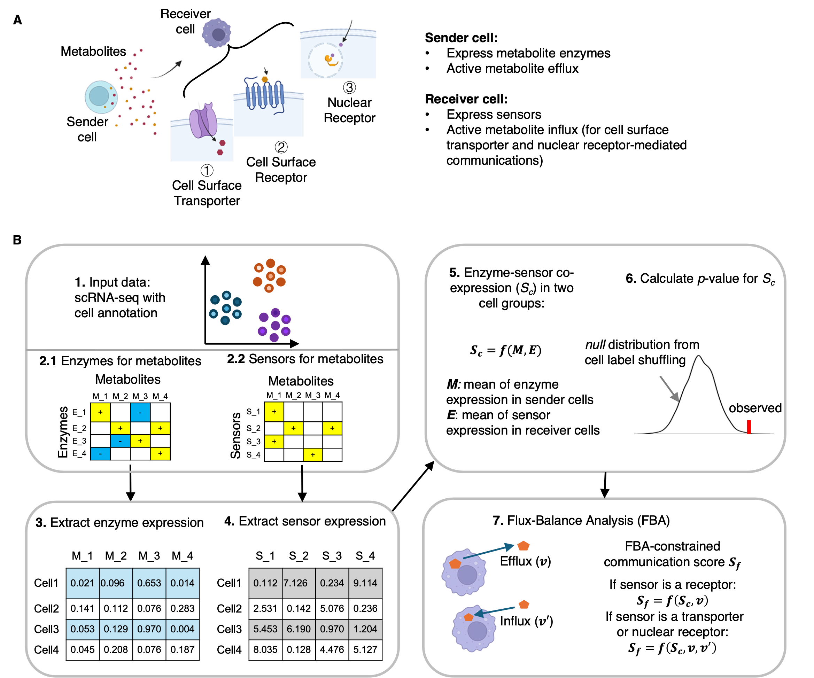

</img>

## V1.2 released for Multiple Samples in One-Run and Differential Analysis.

### Join our email group for conveninent discussions and receive timely updates via <a href='https://forms.cloud.microsoft/r/TK7TuEU4TU' target='_blank'>MicroSoft Form</a>  

### Welcome to use MEBOCOST: <I>Me</I>ta<I>bo</I>lic Cell-Cell <I>Co</I>mmunication Modeling by <I>S</I>ingle Cell <I>T</I>ranscriptome

### Our manuscript has been online at <a href='https://doi.org/10.1093/nar/gkaf569' target='_blank'>Nucleic Acids Research </a>

### What is MEBOCOST and how does it work?

<p>

MEBOCOST is a Python-based computational tool for inferring metabolite, such as lipid, mediated cell-cell communication events using single-cell RNA-seq data. MEBOCOST includes a manually curated database of metabolite-sensor partners and defines sender and receiver cells based on rates of metabolite efflux and influx, along with expression levels of enzyme and sensor genes, respectively.

</p>


#### The Flowchart of MEBOCOST

<p>

workflow for predicting metabolite mediated cell-cell communication (mCCC) taking scRNA-seq data as input.

</p>

</img>

### Version control

<p>Changelog for v1.2</p>

<p>For v1.2.2 (08-08-2025)</p>
<li>Improved differential analysis in computing p values using permutated Log2FC instead of using FC values.</li>

<p>For v1.2.1</p>
<li>main updates: fix code bugs for flux constraint precedure.</li>

<p>For v1.2.0</p>
<li> Flux Integration Flexibility</li>

In addition to the default integration function for COMPASS flux output, added support for integrating flux results provided by users from any external tools using _ConstrainFluxFromAnyTool_ function

<li> Refined Output Table</li>
The output table includes only statistically significant mCCC events based on enzyme-sensor coexpression analysis, while the full original results are saved under the original_result slot. A new column indicates whether flux activity passed the defined threshold, rather than reporting only those events with qualifying flux rates. This design retains potentially interesting mCCC events that are significant based solely on enzyme–sensor coexpression.

<li> Batch Analysis Support </li>
Enabled mCCC analysis for multiple samples in a single run.

<li> Differential mCCC Analysis Options </li>
Added support for differential analysis using: (1) A single object containing multiple samples. (2) Multiple separate result objects combined for comparative analysis

<li> New Plotting Tools </li>
Introduced new plotting functions tailored for differential mCCC results.

<li> Expanded Metabolite-Sensor Pairs </li>
Increase the number to 782 metabolite-sensor pairs. More sensor types are included, such as cell surface channel and cell surface enzymes.  

<li> Updated parameters in some functions: </li>

<p>1. create_obj: changed group_col parameter to a string representing a column name of meta table, no longer accepts a list. </p>

<p>2. create_obj: added condition_col parameter to indicate an annotation column in the meta table to group cells into conditions. The mCCC analysis will perform within each conditions</p>

<p>3. eventnum_bar: added xorder parameters to accept a list of cell types or corresponding labels to reorder x axis labels.</p>

<p>4. All plot functions included condition paramters to visualize results in a specified condition. </p>
<hr>

### Installation

-   download and install miniconda environment (Users can skip this step if a python-based environment has been well-established).

```{bash}
wget https://repo.anaconda.com/miniconda/Miniconda3-latest-Linux-x86_64.sh && bash Miniconda3-latest-Linux-x86_64.sh

conda create -n mebocost python=3.12

conda activate mebocost
```

-   download MEBOCOST package from github

```{bash}
git clone https://github.com/kaifuchenlab/MEBOCOST.git

cd MEBOCOST
```

-   install requirements

```{bash}
pip install -r requirements.txt
```

-   install MEBOCOST

```{bash}
python -m pip install .
```

#### To check whether it has been installed successfully, you can run in python:

```{python}
>>from mebocost import mebocost
```

#### if the mebocost can be imported successfully, you are good!

### Tutorial


<a href='./Demo_one_sample_mCCC_analysis.ipynb' target='_blank'> The mCCC analysis by one scRNA-seq data, including running and visualization. </a>

    
<a href='./Demo_Multisample_mCCC_analysis.ipynb' target='_blank'> The mCCC analysis by scRNA-seq from two or multiple conditions, including Differential Analysis.</a>

<p> 1. Analyze multiple samples by a single run and perform differental analysis.</p>

<p> 2. Run two scRNA-seq samples separately but combined two samples for differential mCCC analysis. </p>

</li>

### Please cite us if you find MEBOCOST is useful to your project.

<p>
Please cite us at <a href='https://doi.org/10.1093/nar/gkaf569' target='_blank'>NAR</a> 
</p>

### Contact

[Rongbin.Zheng\@childrens.harvard.edu](mailto:Rongbin.Zheng@childrens.harvard.edu){.email}

or

[Kaifu.Chen\@childrens.harvard.edu](mailto:Kaifu.Chen@childrens.harvard.edu){.email}

<hr>

Copy Right \@ Kaifu Chen Lab \@ Boston Childrens Hospital / Harvard Medical School
